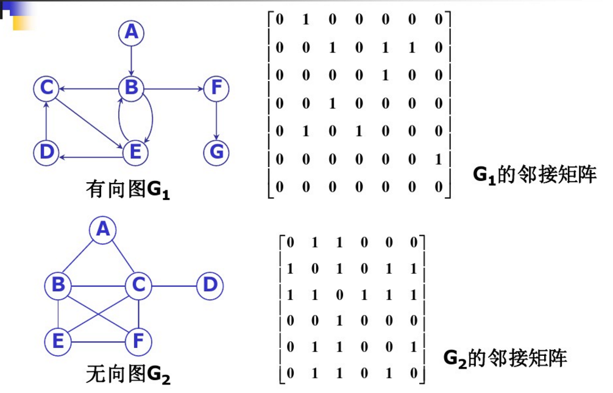

# 图(基础知识)

## 图的表示方法


### 邻接矩阵

设有 N 个顶点，M 条边。
邻接矩阵就是一个 N*N 的矩阵，g[i][j] 表示从节点 i 到节点 j 是否有线连接。
邻接矩阵可以表示有向图，无向图，无向图有一半是重复元素。
邻接矩阵的缺点是： 当边的数量远远少于顶点的时候，空间浪费大。
邻接矩阵的优点是： 可以快速判断任意两个节点之间是否直接相连



### 邻接表

邻接表是一个 N 个元素的数组，每个数组的元素是一个链表，存储与该顶点直接连接的顶点。
邻接表的优点是： 当 N 远大于 M 的时候，节省存储空间
邻接表的缺点是： 无法直接判断两个顶点之间是否直接相连，需要遍历一遍链表才可以判断。


## 广度优先搜索


```python
# G[][] 图的邻接矩阵表示
# color[] 标记点的访问状态
# V 个点， E 条边
outlist = []

color[:] = 0
deque = []
s = 0 # 开始宽度优先搜索的点
deque.append(s)
while len(s) > 0:   
    current = deque.pop(0)
    color[current] = 1
    outlist.append(current)
    for point, value in enumerate(G[current]):
        if value != 0 and color[point] == 0:
            deque.append(point)
    color[current] = 2
```


**LeetCode相关题目**
[127. 单词接龙](../../leetcode/127/readme.md)

## 深度优先搜索


```python
# G[][] 图的邻接矩阵表示
# color[] 标记点的访问状态
# V 个点， E 条边

outlist = []

color[:] = 0
for i in range(V):
    if color[i] == 0:
        DFS(G, i)

def DFS(G, i):
    color[i] = 1
    outlist.append(i)
    for point, value in enumerate(G[i]):
        if value != 0 and color[point] == 0:
            DFS(G, point)
    color[i] = 2
```

**leetcode相关题目**
[797. 所有可能的路径](../../leetcode/797/readme.md)

## 拓扑排序

使用深度优先遍历时访问完每个节点的顺序，逆序输出即可

```python
# G[][] 图的邻接矩阵表示
# color[] 标记点的访问状态
# V 个点， E 条边

outlist = []

color[:] = 0
for i in range(V):
    if color[i] == 0:
        DFS(G, i)

def DFS(G, i):
    color[i] = 1
    outlist.append(i)
    for point, value in enumerate(G[i]):
        if value != 0 and color[point] == 0:
            DFS(G, point)
    color[i] = 2
    outlist.insert(0, i) # 访问完之后逆序输出

```

## 判断图是否有环路

```python
def dfs(G, i, color):
    color[i] = 1
    for j in G[i]:
        if color[j] == 1:
            return True
        if color[j] == 0:
            ans = dfs(G, j, color)
            if ans == True:
                return True
    color[i] = 2
    return False
    
def isHuan(G):
    color = [0] * N
    for i in range(N)
        if color[i] == 0:
            ans = dfs(G, i, color)
            if ans == True:
                return True
    return false
```