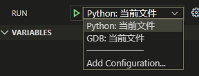

# 配置多种编译环境

vscode 实现一个工程编译C， C++， python 三种语言。

## 前期准备

1. C， C++ 使用 win10 的 wsl, 安装 wsl
2. 安装python

## 配置文件

tasks.json 中添加 c, c++ 编译支持

```shell
{
    "version": "2.0.0",
    "windows": {
        "options": {
            "shell": {
                "executable": "c:\\windows\\System32\\bash.exe",
                "args": ["-c"]
            }
        }
    },
    "tasks": [
        {
            "label": "build",
            "type": "shell",
            "command": "g++",
            "args": [
                "-g",
                "-o",
                "/mnt/d/FF120/workspace/leetcode/tmp/${fileBasename}.out",
                "/mnt/d/FF120/workspace/leetcode/leetcode/${fileBasenameNoExtension}/${fileBasename}"
            ],
            "group": {
                "kind": "build",
                "isDefault": true
            },
            "problemMatcher": []
        }
    ]
}
```

launch.json 中添加 c, c++, python debug 支持：

```shell
{
    // Use IntelliSense to learn about possible attributes.
    // Hover to view descriptions of existing attributes.
    // For more information, visit: https://go.microsoft.com/fwlink/?linkid=830387
    "version": "0.2.0",
    "configurations": [
        {
            "name": "Python: 当前文件",
            "type": "python",
            "request": "launch",
            "program": "${file}",
            "console": "integratedTerminal"
        },
        {
            "name": "GDB: 当前文件",
            "type": "cppdbg",
            "request": "launch",
            "program": "/mnt/d/FF120/workspace/leetcode/tmp/${fileBasename}.out",
            "args": ["-fThreading"],
            "stopAtEntry": true,
            "cwd": "/mnt/d/FF120/workspace/leetcode/",
            "environment": [],
            "externalConsole": true,
            "windows": {
                "MIMode": "gdb",
                "miDebuggerPath": "/usr/bin/gdb",
                "setupCommands": [
                    {
                        "description": "Enable pretty-printing for gdb",
                        "text": "-enable-pretty-printing",
                        "ignoreFailures": true
                    }
                ]
            },
            "pipeTransport": {
                "pipeCwd": "",
                "pipeProgram": "c:\\windows\\System32\\bash.exe",
                "pipeArgs": ["-c"],
                "debuggerPath": "/usr/bin/gdb"
            },
            "sourceFileMap": {
                "/mnt/d": "d://",
                "/usr": "C:\\Users\\FF120\\AppData\\Local\\Packages\\KaliLinux.54290C8133FEE_ey8k8hqnwqnmg\\LocalState\\rootfs\\usr\\"
            },
            "preLaunchTask" : "build"
        }
    ]
}
```

注意 tasks.json 中配置的路径， 文件名称要和 launch.json 中配置的吻合。把其中具体的路径按照需要改成自己的路径即可。

配置 c_cpp_properties.json 实现头文件包含跳转

```shell
{
    "configurations": [
        {
            "name": "Win32",
            "includePath": [
                "${workspaceFolder}/**"
            ],
            "defines": [
                "_DEBUG",
                "UNICODE",
                "_UNICODE"
            ],
            "compilerPath": "/usr/bin/g++",
            "cStandard": "c11",
            "cppStandard": "c++17",
            "intelliSenseMode": "gcc-x64"
        }
    ],
    "version": 4
}
```

## 效果



1. c, c++ 编译环境依赖 wsl, 不二外安装软件
2. c, C++, python debug 生成的文件在 tmp 目录， 不污染原来目录
3. 根据源文件类型， 选择编译选项

想实现根据文件扩展名自动选择调用哪个编译配置，暂时没有找到如何设置。
